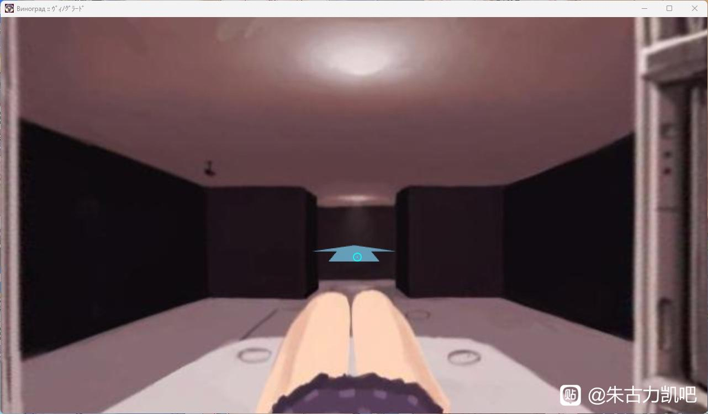

10.葡萄园（vinograd）
---
起初玩这个游戏是因为看了群里某个聊天记录才去玩的，说是什么第一视角艾草还有r18g，结果下载下来发现确实是有但是是一坨机翻，因此剧情这一块真的是完全看不太懂，妈勒个巴子的太意识流了，后来刷b站看到有人解析剧情总算是能看懂一点

游戏玩法为解密，主视角为第一人称，纯鼠标操作，左键点击可以移动视角，非常不平滑，看久了会头晕

女主角立绘个人感觉比较可爱，cg画的也还可以（不算上猎奇部分），但是吧不太能用，大部分cg都没有抖擞精神的画面，猎奇居多

剧情主要围绕四个人物展开，女主、女主的男朋友（以下称男主）、研究所所长、以及助手，男主是所长的助手，并且助手对男主抱有好感，而所长对女主觊觎已久，于是想方设法搞到了女主的血液并克隆了女主出来满足他的欲望。

某天男主和女主在海滩玩耍，女主在上厕所时见到了助手，助手为了和男主在一起而骗女主说男主在实验室等他，但到了实验室后，女主直接被所长强暴了，所长以为这个女主只是克隆体，后来男主赶到发现女主已经被玩死了，而所长嚣张的发出ntr宣言并将男女主扔到了克隆用的虚拟电脑内作养料。后来男主在虚拟电脑内成为了怪物，在电脑内搞破坏，导致所长克隆出来的克隆体多半是不成人形的肉块，为了引导出人形的克隆体，所长便操控电脑引导女主，于是便有游戏开幕时克隆体的女主在虚拟电脑内醒来。

女主先是受到所长引导到传送装置，拼死抵抗后导致虚拟电脑重构空间，卡bug来到了现实世界，然后发现自己无数的克隆尸体，还被所长追杀，逃脱后受到了助手的帮助，脱离了克隆房怪物的追杀，后来在回忆中明白了男主原来一直在虚拟电脑内保护自己，于是便在电脑内和男主永远在一起，可喜可贺可喜可贺

总之整个游戏玩下来感觉整个人都是懵逼的，要是没有解析真看不懂吧，并不太推荐游玩，除非想看一下都有哪些猎奇cg可以去玩一下

（附上两个bv号，乐意云一下的话可以看看 BV1rGnZekEr3 BV1d6afeaEGh）

<small style="color:gray; display:block; text-align:center;">游戏画面</small>

---
推荐度3/10
---
实用度1/10
---
可玩性5/10
---