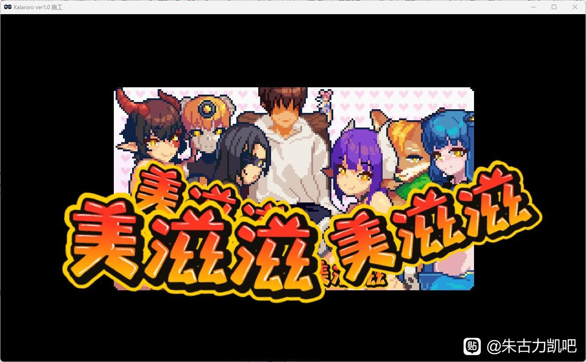

11.KLARORO ABYSS OF THE SOUL
---
看到像素画和魔物娘直接走不动路，于是玩了

一开始游玩的是demo版，写这篇的时候已经有了1.0的正式版，并且重新游玩了一遍

游戏体量很小，一百多MB的小游戏，主要采用横版ACT的玩法，男主通过手机里的催眠APP来与各种魔物娘战斗，游戏内全是boss战，没有道中战斗，并且可以在开始房间选择想要游玩的关卡，值得一提的是最终boss有上锁，得挑战完前面全部boss才能与最终boss进行战斗

游戏内boss有眩晕条和血条，随着游戏进行后面的boss血条会越长，通过发射弹幕来增加眩晕条，条满了后靠近boss来进行QTE，反复按左右方向键让boss扣血，中途眩晕条会一直减少，一管血扣完后就能发射♂弹幕，boss会通过各种招式让你扣血，招式设计比较酷炫，不过非常的重复，玩家可以利用翻滚来躲避并找到机会进行反击，设计简单并且不失趣味性，我觉得十分好玩

可能由于是1.0版本所以并没有太多剧情上的讲述，只有几张图片，个人猜测应该是男主被传送到异世界，被派遣去收服各种魔物娘吧大概，游戏到最后可以选择留在这里或是离去，留下就是在这里开后宫了，爽啊

CG方面没有什么好讲的，涩涩的终点是像素，还是非常好看的，无须多言（不过有个boss是男的有点雷了）

这款属于是小甜点了，体量小，操作到位基本上30分钟内就能够通关，CG好看，玩法有意思，个人感觉是比较优秀的游戏，还是比较推荐游玩的，最后附上结局CG

<small style="color:gray; display:block; text-align:center;">Good end</small>

---
推荐度7/10
---
实用度6/10
---
可玩性8/10
---