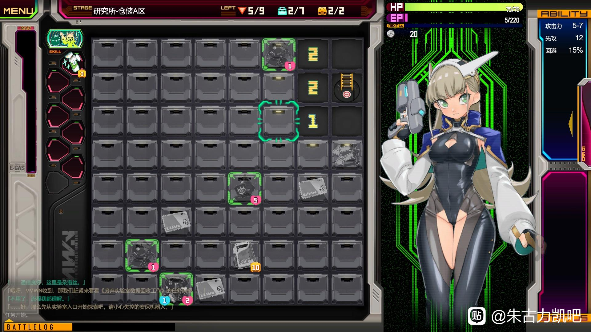

13.LabSweeper
---
扫雷小游戏，cg较重口，我不喜欢，我只想杀。游戏有剧情，有双结局，还有成就系统，完成成就给予永久加成，有天赋加点系统可以让通过更轻松

整体玩法和扫雷大差不差，主要是有一个战斗系统以及某个紫色条，每步操作都会让紫色条上升，下到下一层时会让紫条减少，因此在破关的时候需要注意自己的目标是快速下楼还是清扫整层。

游戏剧情讲述了女主在公司要求下去执行一项任务，一层层往实验室下方前进，到底层后公司把女主的战斗工具系统全都关闭了，只是想让女主作为苗床继续待在实验室最底层，最后女主想尽办法往上层脱离，还是逃离了这座实验室。

游戏中的关卡一共九关+一关连续39层不允许使用的挑战关卡，和剧情是相对应的。

是一部完成度很高的小游戏，扫雷+战斗的玩法让人眼前一亮，就是题材这一块异种和机械这一块我不喜欢，但他仍然是款好游戏。

<small style="color:gray; display:block; text-align:center;">游戏界面</small>

---
推荐度8/10
---
实用度2/10
---
可玩性9/10
---