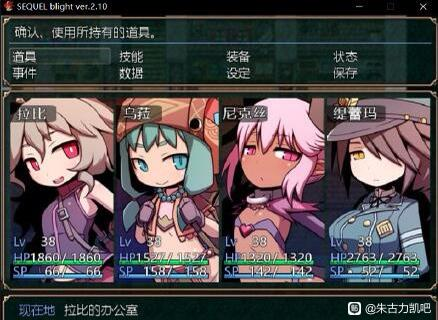
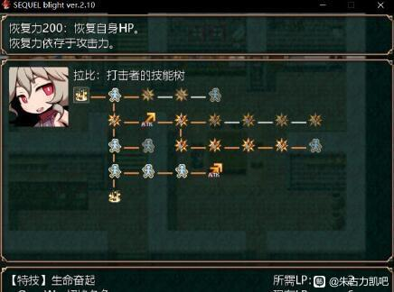

2.废土之旅系列
---
RPG游戏，也是在平板的模拟器上玩的，很好玩，在当年应该算是挺能打的一批了

距离游玩的时间较久，手里头已经没游戏文件了，剧情也不大记得了，大概剧情是讲这个世界的玛娜即将凋零，玛娜就是类似生命力的存在，没有玛娜人就无法存活，玛娜能自然产生，但快被采集殆尽；玛娜也可以通过从死去的人身上获得，但由于玛娜枯竭而导致大多数国家都在通过战争杀人来获得玛娜；玛娜同样也可以从男人身上获得，但这世界上只剩下你一个男性了，而你刚从昏迷中醒来，在乱逛的时候遇到一名女冒险家并且被捡走，为了解决玛娜危机你们踏上了旅途并遇上三名同样为了解决玛娜枯竭问题的旅行伙伴，最终一同解决玛娜危机的故事。

<small style="color:gray; display:block; text-align:center;">四个女主</small>

游戏完成度高，剧情完整，四名女主各自有特点且能通过升级加点学技能，或者是转职（RPG常规操作了），游戏支线任务多，还有后日谈boss游戏画风十分萌，并且非常有辨识度，比较实用，游戏还有好感度系统，临近结局还能与主要女角色进行契约，可以说制作是非常用心了，以及游戏bgm是真的很令我印象深刻，非常的有感觉，特别是某个主城的bgm，我现在都一直记着，真的非常好听洗脑，在黄油rpg里可以算是六边形战士，十分能打，能当做普通游戏玩的黄油，推荐游玩。

<small style="color:gray; display:block; text-align:center;">游戏技能树展示</small>

整部系列据我所知已有五部，作者还在发力继续做，分别是我玩过的SEQUEL blight还有我没玩过的SEQUEL awake、SEQUEL colony、SEQUEL kludge以及SEQUEL thirst，应该会去玩的吧大概也许。顺带一提本人比较喜欢游戏里的萝莉黑皮魅魔尼克斯，这家伙还有作者画的同人本，赞爆。

<small style="color:gray; display:block; text-align:center;">魅魔尼克斯</small>

---
推荐度10/10
---
实用度8/10
---
可玩性9/10
---
