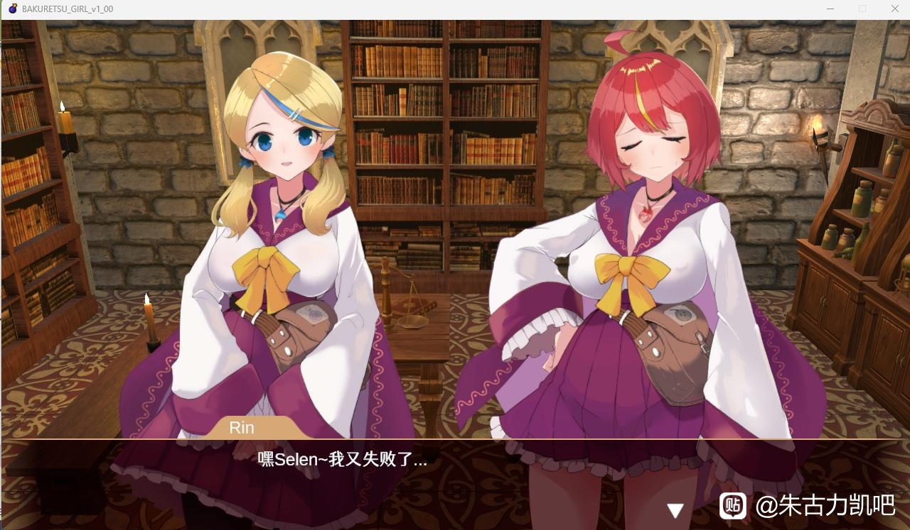
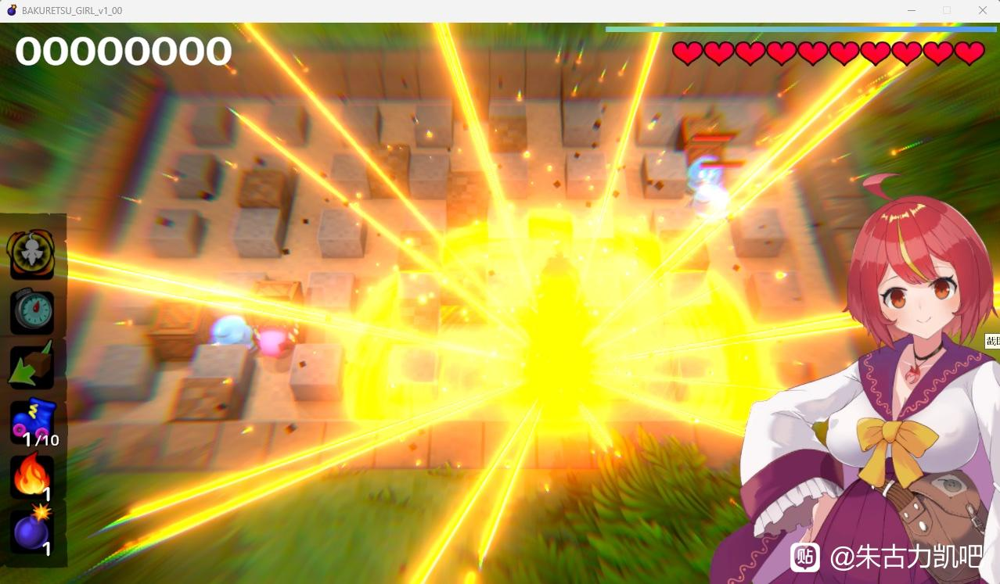
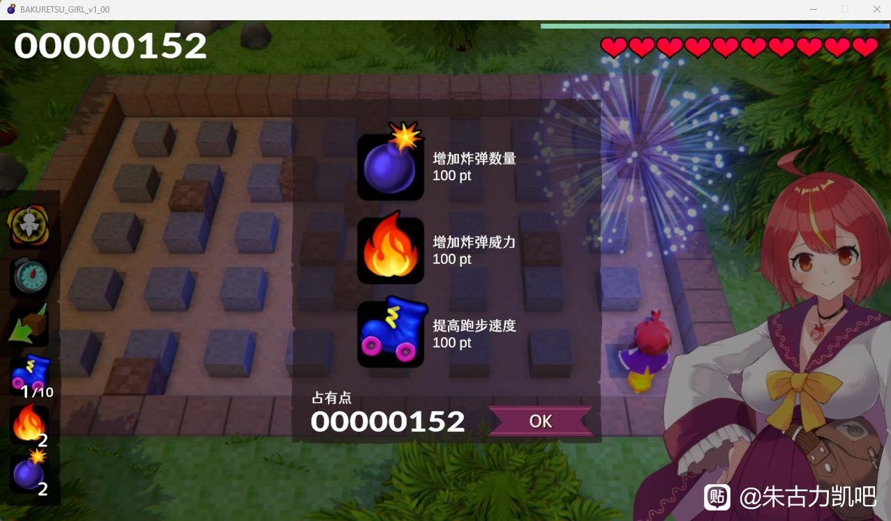

4.爆裂少女 黑暗炼金术与羁绊之炎
---
个人体验一般的小游戏，不是很好玩。

讲述了两个女炼金术士的故事，红头发炼金术士rin不论怎么炼金都只会爆炸，于是金头发炼金术士selen向rin提出了制作炸弹这一点子，rin表示赞同并外出收集材料，收集结束回到家中却发现selen不见了，于是带上炸弹前往森林深处寻找selen，故事最后救出selen，二人幸终的故事。

<small style="color:gray; display:block; text-align:center;">女主角</small>

游戏玩法和泡泡堂一样，放置炸弹可以炸毁障碍物以及清除魔物，炸怪物和障碍物可以获得pt点数，每关结算可以进行升级，分别是速度，炸弹数量，以及移动速度，其中移动速度是有升级限制的，而炸弹数量以及威力并没有限制。游戏后期可以捡到一些实用的道具，如保护自己不受到炸弹伤害、爆炸可以穿透障碍物、和按按键直接引爆炸弹，游戏cg通过战败以及和怪物接触并不挣扎解锁，对象为史莱姆、兽人等魔物，动态，有cv。

<small style="color:gray; display:block; text-align:center;">爆！</small>

游戏不好玩是因为爆炸威力和炸弹数量可以无限升级，玩到一定程度时爆炸的十字就能横穿整个地图，而当捡到防止炸弹伤害的道具时，你就可以瞎坤吧放炸弹，乱炸，并且防护罩在你身上时有30秒倒计时，而你捡到一颗红心时就会重置这30秒，重新计时，所以基本进入地图后只要找到防护罩这一关就已经过了，到了后面还能捡到掐瞬爆雷的道具，套着个盾走到哪炸到哪。

<small style="color:gray; display:block; text-align:center;">升级界面</small>

如果想直接观看cg而不想游玩游戏的话作者还特别贴心的留了一个直接在图鉴解锁全cg的密钥，只要输入就能解锁全cg，，，
总体而言，算比较中规中矩的小游戏，角色live2d做的不错，但是我不太喜欢。

---
推荐度3/10
---
实用度4/10
---
可玩性5/10
---