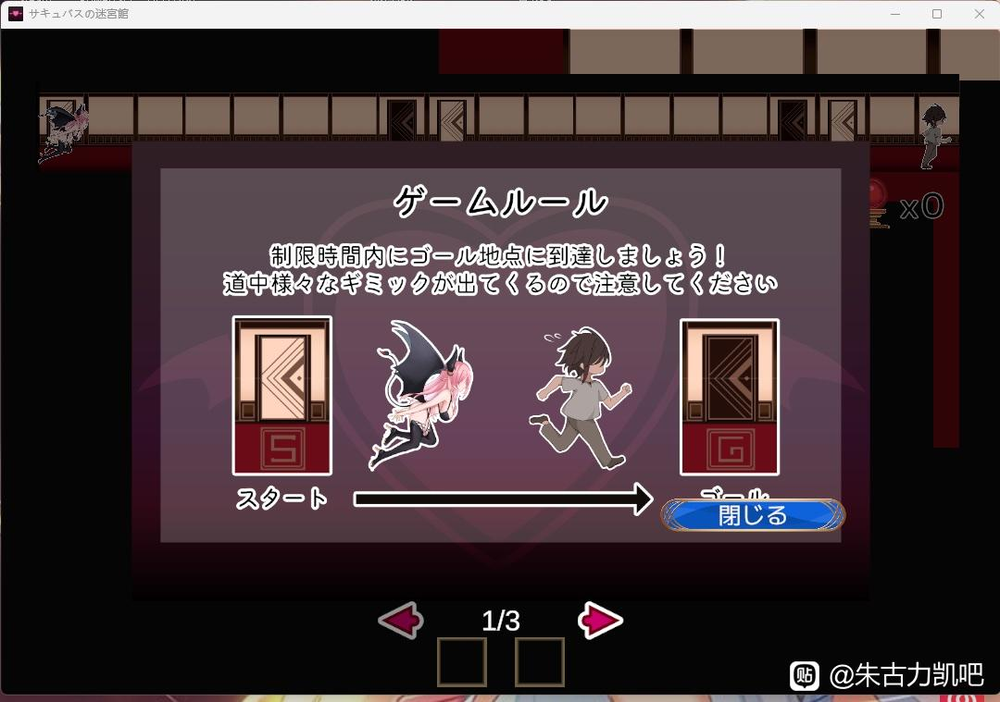
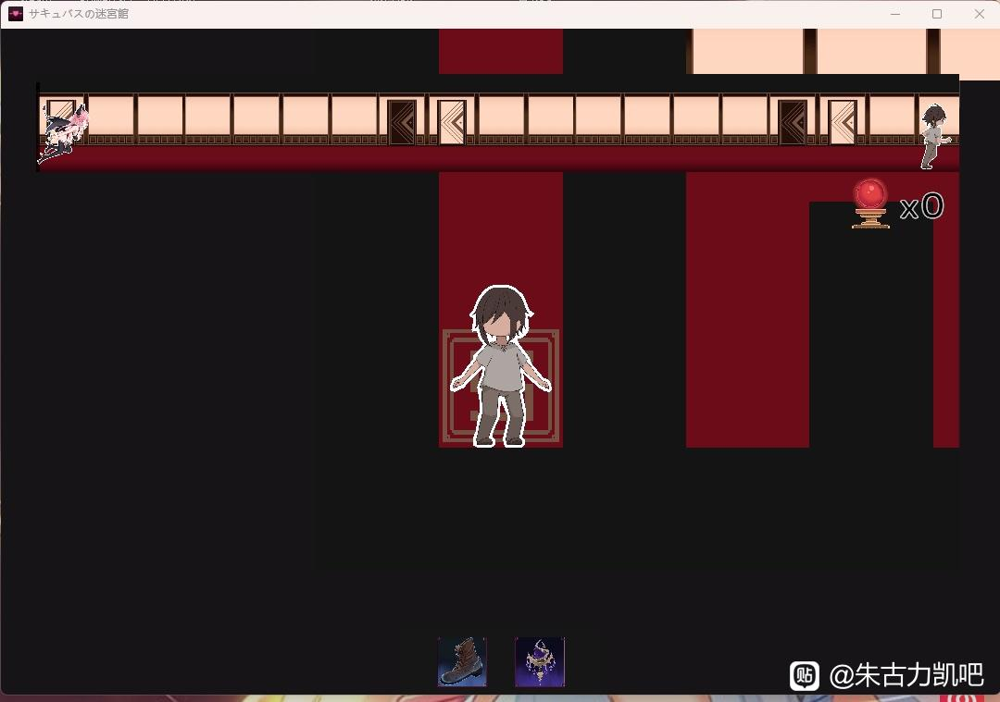

7.サキュバスの迷宮館
---
益智小游戏，讲述一男子在森林迷路误入魅魔的宅邸，被困其中想方设法出逃的故事

游戏玩法是走迷宫，在限定时间内开启所有开关并找到出口即为胜利，过程中会遇到一些小事件，会给一些buff或者是debuff，加速或减速以及指向出口一类，开局前可以选择一些对通关有利的道具，然后进行选关攻略，通关后会有个无尽模式。

<small style="color:gray; display:block; text-align:center;">玩法教程</small>

个人感觉走迷宫算是比较无聊的玩法，整体体验下来也是比较无聊，走迷宫的过程有点坐牢，流程算是比较短的。cg中规中矩，属于能冲但不多，评价为可以玩一下的程度。

<small style="color:gray; display:block; text-align:center;">游戏画面</small>

---
推荐度4/10
---
实用度5/10
---
可玩性5/10
---